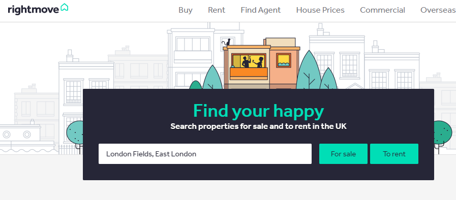
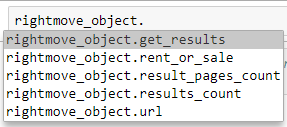
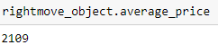
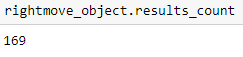
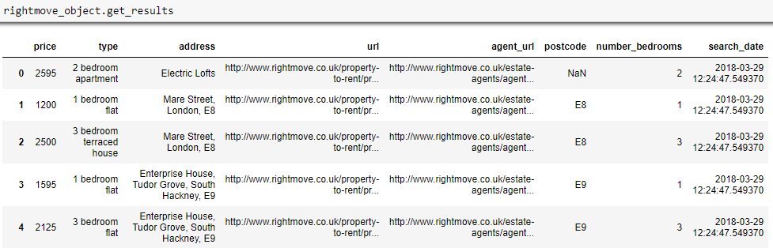
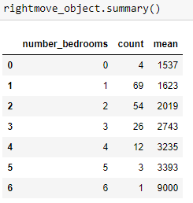
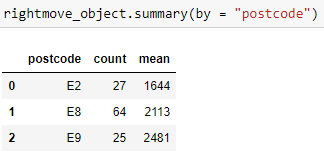

# rightmove_webscraper

<a href="http://www.rightmove.co.uk/" target="_blank">rightmove.co.uk</a> is one of the UK's largest property listings websites, hosting thousands of listings of properties for sale and to rent.

<code>rightmove_webscraper.py</code> is a simple Python interface to scrape property listings from the website and prepare them in a Pandas dataframe for analysis.

## Installation

Version 0.3 is now available as a package with all required dependencies on Pip.

Install with:

 <code>pip install -U rightmove-webscraper</code>

## How to use

1) Go to <a href="http://www.rightmove.co.uk/">rightmove.co.uk</a> and search for whatever listings you are interested in ...



2) Filter the search however you choose ...


3) Run the search and copy the URL of the results page ...


4) Create an instance of the class on the URL ...

```python
from rightmove_webscraper import rightmove_data
url = "http://www.rightmove.co.uk/property-for-sale/find.html?locationIdentifier= [...] "
rightmove_object = rightmove_data(url)
```

5) Access the data using the methods and attributes of the object ...



Find the average price of all listings returned by the search:

```python
rightmove_object.average_price
```



Show the total number of listings returned by the search:

```python
rightmove_object.results_count
```



Access the full results as a Pandas dataframe with the <code>.get_results</code> attribute.

```python
rightmove_object.get_results
```


Get quick summary statistics of the results, showing the number of listings and average price grouped by the number of bedrooms:

```python
rightmove_object.summary()
```


Alternatively group the results by any other column returned in the <code>.get_results</code> DataFrame, for example Postcode:

```python
rightmove_object.summary(by = "postcode")
```


## Legal
<a href="https://github.com/toddy86">@toddy86</a> has pointed out per the terms and conditions <a href="https://www.rightmove.co.uk/this-site/terms-of-use.html"> here</a> the use of webscrapers is unauthorised by rightmove. So please don't use this package!
