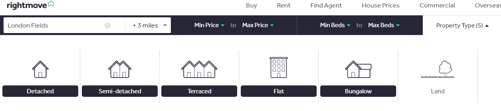
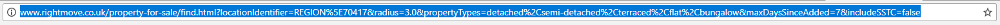
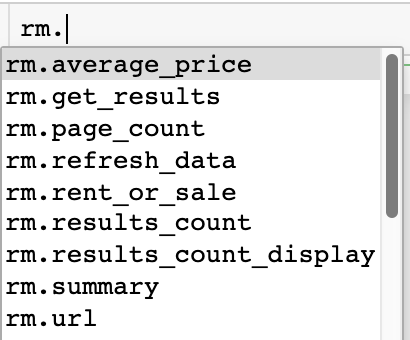
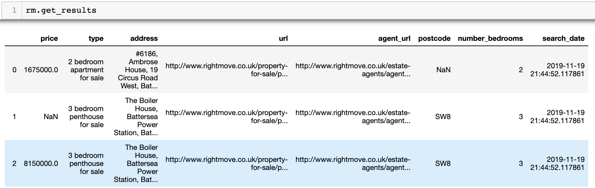
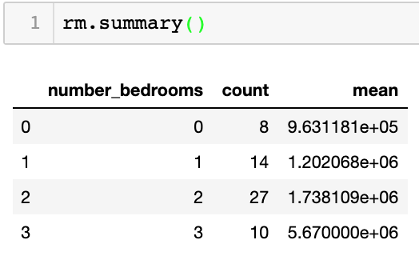
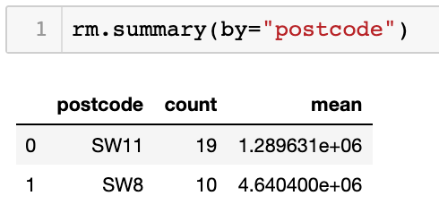

# rightmove-webscraper

[](https://pepy.tech/project/rightmove-webscraper)

<a href="http://www.rightmove.co.uk/" target="_blank">rightmove.co.uk</a> is one of the UK's largest property listings websites, hosting thousands of listings of properties for sale and to rent.

<code>rightmove_webscraper.py</code> is a simple Python interface to scrape property listings from the website and prepare them in a Pandas dataframe for analysis.

## Installation

Version 1.0 is now available to install via Pip:

 <code>pip install -U rightmove-webscraper</code>

## How to use

1) Go to <a href="http://www.rightmove.co.uk/">rightmove.co.uk</a> and search for whatever listings you are interested in ...


2) Filter the search however you choose ...




3) Run the search and copy the URL of the results page ...



4) Create an instance of the class on the URL ...

```python
from rightmove_webscraper import RightmoveData

url = "https://www.rightmove.co.uk/property-for-sale/find.html?searchType=SALE&locationIdentifier=REGION%5E94346"
rm = RightmoveData(url)
```

5) Access the data using the methods and attributes of the object ...



Get the average price of all listings returned by the search:

```python
rm.average_price
```


Show the total number of listings returned by the search:

```python
rm.results_count
```


Access the full results as a Pandas dataframe at the <code>.get_results</code> attribute.

```python
rm.get_results
```


Get quick summary statistics of the results, showing the number of listings and average price grouped by the number of bedrooms:

```python
rm.summary()
```


Alternatively group the results by any other column returned in the <code>.get_results</code> DataFrame, for example Postcode:

```python
rm.summary(by="postcode")
```


## Legal
<a href="https://github.com/toddy86">@toddy86</a> has pointed out per the terms and conditions <a href="https://www.rightmove.co.uk/this-site/terms-of-use.html"> here</a> the use of webscrapers is unauthorised by rightmove. So please don't use this package!
